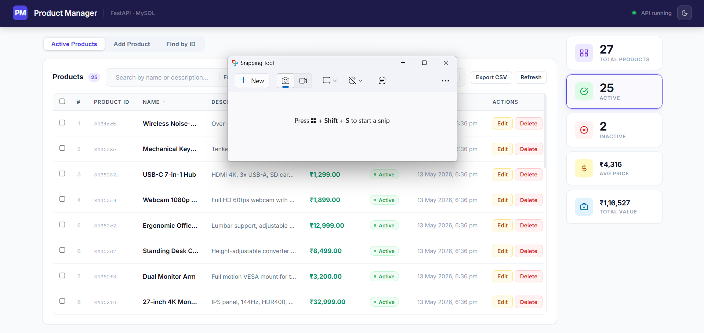
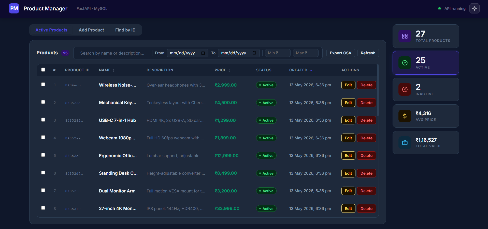
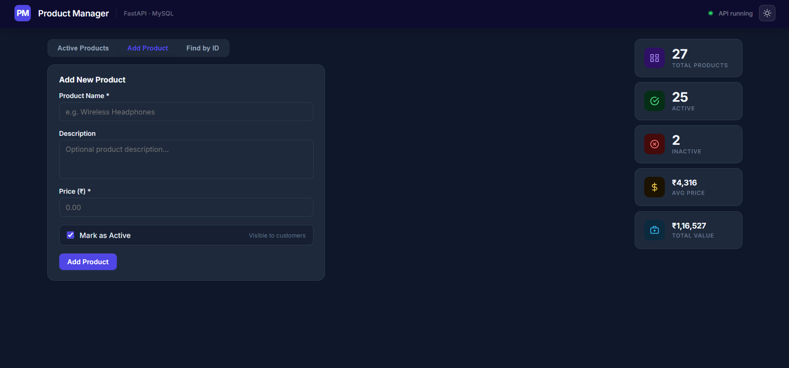

<div align="center">

# 🛒 Product Manager

**A full-stack product management application built with FastAPI, MySQL, and React**

[](https://fastapi.tiangolo.com/)
[](https://react.dev/)
[](https://www.mysql.com/)
[](https://python.org/)
[](https://www.sqlalchemy.org/)
[](https://axios-http.com/)

</div>

---

## 📌 Table of Contents

- [Overview](#-overview)
- [Tech Stack](#-tech-stack)
- [Features](#-features)
- [Project Structure](#-project-structure)
- [Architecture](#-architecture)
- [Database Schema](#-database-schema)
- [API Reference](#-api-reference)
- [Getting Started](#-getting-started)
- [Environment Variables](#-environment-variables)
- [Running the App](#-running-the-app)
- [UI Walkthrough](#-ui-walkthrough)
- [Screenshots](#-screenshots)

---

## 🔍 Overview

**Product Manager** is a full-stack CRUD application that lets you manage a product catalogue through a clean, modern React dashboard. The backend is powered by **FastAPI** with a **MySQL** database via **SQLAlchemy ORM**, and the frontend is a **Create React App** project that communicates with the API over HTTP.

Each product has a name, description, price, and active/inactive status. The dashboard gives you real-time statistics, powerful filtering, sorting, inline editing, bulk operations, CSV export, and a dark mode — all in one place.

---

## 🧰 Tech Stack

| Layer | Technology | Purpose |
|---|---|---|
| **Backend** | FastAPI | REST API framework |
| **ORM** | SQLAlchemy | Database abstraction |
| **Validation** | Pydantic v2 | Request / response schemas |
| **Database** | MySQL 8+ | Persistent data storage |
| **DB Driver** | PyMySQL | Python → MySQL connector |
| **Frontend** | React 19 (CRA) | UI framework |
| **HTTP Client** | Axios | API calls from React |
| **Styling** | Pure CSS (CSS Variables) | Theming, dark mode |
| **Dev Runner** | concurrently | Run API + UI with one command |

---

## ✨ Features

### Dashboard
- **Live stats sidebar** — Total, Active, Inactive counts + Average Price + Total Catalogue Value
- **Clickable stat cards** — click Total / Active / Inactive to filter the table instantly
- **Dark mode** — toggle between light and dark themes; preference persists across sessions

### Products Table
| Feature | Details |
|---|---|
| **Search** | Filter by product name or description in real time |
| **Date filter** | Filter products by creation date range |
| **Price filter** | Filter by minimum and/or maximum price |
| **Sort** | Click column headers (Name, Price, Created) to sort asc/desc |
| **Status toggle** | Click Active / Inactive badge directly in the row to flip status instantly |
| **Hover preview** | Hover over a product name to see a floating card with full details |
| **Copy UUID** | Click any Product ID cell to copy it to clipboard |
| **Row selection** | Checkbox per row + select-all for bulk operations |
| **Bulk delete** | Select multiple products and delete them all at once |
| **CSV export** | Download all visible (filtered) rows as a `.csv` file |
| **Edit** | Open a pre-filled modal to update any product field |
| **Delete** | Delete a single product with a confirmation modal |

### Other Pages
- **Add Product** — Form to create a new product with name, description, price, and status
- **Find by ID** — Look up any product instantly by its UUID

---

## 📁 Project Structure

```
FastAPI/
│
├── main.py                  # FastAPI app — all 5 endpoints
├── database.py              # SQLAlchemy engine, session, Base
├── db_models.py             # ORM model — ProductORM table
├── model.py                 # Pydantic schemas (Product, ProductCreate, ProductUpdate)
│
├── .env                     # DB credentials (not committed)
├── .gitignore
├── package.json             # Root — runs both servers via `concurrently`
├── requirements.txt         # Python dependencies
│
├── myenv/                   # Python virtual environment (not committed)
│
└── frontend/                # React application (Create React App)
    ├── public/
    │   └── index.html
    └── src/
        ├── App.js           # Root component — tabs, theme, sidebar stats
        ├── App.css          # All styles with CSS variables (light + dark)
        ├── index.css        # Global reset + font
        │
        ├── api/
        │   └── productApi.js        # Axios wrapper — all 5 API calls
        │
        ├── utils/
        │   └── format.js            # Currency (INR) + date formatters
        │
        └── components/
            ├── ProductsTab.js       # Main table with all features
            ├── AddProductTab.js     # Add product form
            ├── FindByIdTab.js       # UUID lookup page
            ├── EditModal.js         # Edit product modal
            └── DeleteModal.js       # Delete confirmation modal
```

---

## 🏗️ Architecture

```
┌─────────────────────────────────────────────────────────────┐
│                        BROWSER                               │
│                                                             │
│   ┌─────────────────────────────────────────────────────┐  │
│   │                  React Frontend                      │  │
│   │                 localhost:3000                       │  │
│   │                                                     │  │
│   │  App.js ──► ProductsTab ──► EditModal               │  │
│   │          ├─► AddProductTab   DeleteModal            │  │
│   │          └─► FindByIdTab                            │  │
│   │                   │                                 │  │
│   │            productApi.js (Axios)                    │  │
│   └───────────────────┼─────────────────────────────────┘  │
└───────────────────────┼─────────────────────────────────────┘
                        │ HTTP (proxied in dev)
                        ▼
┌─────────────────────────────────────────────────────────────┐
│                   FastAPI Backend                            │
│                  localhost:8000                              │
│                                                             │
│   main.py                                                   │
│   ├── GET  /getallproducts                                  │
│   ├── GET  /getproductbyid/{id}                             │
│   ├── POST /addproduct                                       │
│   ├── PUT  /updateproduct/{id}                              │
│   └── DELETE /deleteproduct/{id}                            │
│                   │                                         │
│           SQLAlchemy ORM                                     │
│            database.py                                      │
└───────────────────┼─────────────────────────────────────────┘
                    │ PyMySQL
                    ▼
┌─────────────────────────────────────────────────────────────┐
│                  MySQL Database                              │
│                                                             │
│   Table: products                                           │
│   ┌──────────────┬──────────────────────────────────────┐  │
│   │ id           │ VARCHAR(36) PRIMARY KEY (UUID)        │  │
│   │ name         │ VARCHAR(200) NOT NULL                 │  │
│   │ description  │ TEXT NULLABLE                         │  │
│   │ price        │ FLOAT NOT NULL                        │  │
│   │ is_active    │ BOOLEAN DEFAULT TRUE                  │  │
│   │ created_at   │ DATETIME                              │  │
│   │ updated_at   │ DATETIME                              │  │
│   └──────────────┴──────────────────────────────────────┘  │
└─────────────────────────────────────────────────────────────┘
```

---

## 🗄️ Database Schema

```sql
CREATE TABLE products (
    id          VARCHAR(36)  NOT NULL PRIMARY KEY,   -- UUID string
    name        VARCHAR(200) NOT NULL,
    description TEXT,
    price       FLOAT        NOT NULL,
    is_active   BOOLEAN      NOT NULL DEFAULT TRUE,
    created_at  DATETIME     NOT NULL,
    updated_at  DATETIME     NOT NULL
);
```

> The table is auto-created on startup via `Base.metadata.create_all(bind=engine)` — no manual migration needed.

---

## 📡 API Reference

Base URL: `http://localhost:8000`

### `GET /getallproducts`
Returns all products in the database.

**Response `200`**
```json
[
  {
    "id": "550e8400-e29b-41d4-a716-446655440000",
    "name": "Wireless Headphones",
    "description": "Noise cancelling over-ear headphones",
    "price": 3499.99,
    "is_active": true,
    "created_at": "2025-05-10T10:30:00",
    "updated_at": "2025-05-10T10:30:00"
  }
]
```

---

### `GET /getproductbyid/{id}`
Find a single product by its UUID.

| Parameter | Type | Description |
|---|---|---|
| `id` | `UUID` | Product UUID |

**Response `200`** — Product object  
**Response `404`** — `{"detail": "Product not found"}`

---

### `POST /addproduct`
Create a new product.

**Request Body**
```json
{
  "name": "Wireless Headphones",
  "description": "Optional description",
  "price": 3499.99,
  "is_active": true
}
```

| Field | Type | Required | Constraints |
|---|---|---|---|
| `name` | string | ✅ | max 200 chars |
| `description` | string | ❌ | max 1000 chars |
| `price` | float | ✅ | must be > 0 |
| `is_active` | boolean | ❌ | default: `true` |

**Response `200`** — Created product with generated `id`, `created_at`, `updated_at`

---

### `PUT /updateproduct/{id}`
Partially update an existing product. Only send the fields you want to change.

**Request Body** (all fields optional)
```json
{
  "name": "Updated Name",
  "price": 2999.00,
  "is_active": false
}
```

**Response `200`** — Updated product object  
**Response `404`** — `{"detail": "Product not found"}`

---

### `DELETE /deleteproduct/{id}`
Permanently delete a product.

**Response `200`**
```json
{ "message": "Product 'Wireless Headphones' deleted successfully" }
```
**Response `404`** — `{"detail": "Product not found"}`

---

## 🚀 Getting Started

### Prerequisites

Make sure you have the following installed:

- [Python 3.10+](https://www.python.org/downloads/)
- [Node.js 18+ & npm](https://nodejs.org/)
- [MySQL 8.0+](https://dev.mysql.com/downloads/)
- [Git](https://git-scm.com/)

---

### 1. Clone the repository

```bash
git clone https://github.com/YOUR_USERNAME/fastapi-product-manager.git
cd fastapi-product-manager
```

---

### 2. Set up the Python backend

```bash
# Create and activate virtual environment
python -m venv myenv

# Windows
myenv\Scripts\activate

# macOS / Linux
source myenv/bin/activate

# Install dependencies
pip install -r requirements.txt
```

---

### 3. Set up the React frontend

```bash
# Install root dev tools (concurrently)
npm install

# Install React dependencies
cd frontend
npm install
cd ..
```

---

### 4. Set up the database

Create a database in MySQL:

```sql
CREATE DATABASE productdb;
```

> The `products` table will be created automatically when the backend starts.

---

## 🔑 Environment Variables

Create a `.env` file in the **project root** (same folder as `main.py`):

```env
DB_USER=root
DB_PASSWORD=your_mysql_password
DB_HOST=localhost
DB_PORT=3306
DB_NAME=productdb
```

> ⚠️ Never commit `.env` to version control. It is already listed in `.gitignore`.

---

## ▶️ Running the App

### Option A — Run both servers with one command (recommended)

```bash
npm run dev
```

This starts both the FastAPI backend and the React frontend simultaneously using `concurrently`.

---

### Option B — Run servers separately

**Terminal 1 — Backend**
```bash
myenv\Scripts\activate          # Windows
# source myenv/bin/activate     # macOS/Linux
uvicorn main:app --reload
```

**Terminal 2 — Frontend**
```bash
cd frontend
npm start
```

---

### Access the app

| Service | URL |
|---|---|
| **React App** | http://localhost:3000 |
| **FastAPI** | http://localhost:8000 |
| **API Docs (Swagger)** | http://localhost:8000/docs |
| **API Docs (Redoc)** | http://localhost:8000/redoc |

---

## 🖥️ UI Walkthrough

### Dashboard Layout

```
┌──────────────────────────────────────────────────────────────┐
│  navbar:  PM  Product Manager  ·  FastAPI · MySQL  [🌙/☀️]  │
├────────────────────────────────────────┬─────────────────────┤
│                                        │  ┌───────────────┐  │
│  [Active Products] [Add Product]       │  │ 🟦 Total   12 │  │
│  [Find by ID]                          │  ├───────────────┤  │
│                                        │  │ ✅ Active   9 │  │
│  ┌──────────────────────────────────┐  │  ├───────────────┤  │
│  │  Products  9  [search...]  From  │  │  │ ❌ Inactive 3 │  │
│  │  [date] To [date] Min₹ Max₹     │  │  ├───────────────┤  │
│  │  [Export CSV]  [Refresh]         │  │  │ ₹ Avg Price   │  │
│  ├──┬──┬────────┬──────┬──────┬────┤  │  ├───────────────┤  │
│  │☐ │# │ID      │Name  │Price │... │  │  │ 💼 Total Val  │  │
│  ├──┼──┼────────┼──────┼──────┼────┤  │  └───────────────┘  │
│  │  │  │        │      │      │    │  │                      │
│  └──┴──┴────────┴──────┴──────┴────┘  │                      │
└────────────────────────────────────────┴─────────────────────┘
```

### Tab Pages

| Tab | Description |
|---|---|
| **Active Products** | Shows only `is_active = true` products |
| **Add Product** | Form with name, description, price, status fields |
| **Find by ID** | Paste a UUID to fetch and display a single product |
| *(via sidebar)* **Total Products** | Shows all products (active + inactive) |
| *(via sidebar)* **Inactive** | Shows only `is_active = false` products |

---

## 📸 Screenshots

### 🌤️ Dashboard — Light Mode
> The main product table with search, filters, sort, status toggle, and sidebar stats in light theme.



---

### 🌙 Dashboard — Dark Mode
> The same dashboard with the dark theme enabled. Preference is saved automatically across sessions.



---

### ➕ Add Product
> The Add Product tab with a clean form for entering product name, description, price, and active status.



---

## 📦 Python Dependencies

```
fastapi
uvicorn[standard]
sqlalchemy
pymysql
pydantic
python-dotenv
```

Generate / update `requirements.txt`:
```bash
pip freeze > requirements.txt
```

---

## 🔒 Security Notes

- `.env` is excluded from git via `.gitignore` — never expose database credentials
- CORS is configured to only allow `http://localhost:3000` — update for production deployments
- All UUIDs are generated server-side with `uuid4()` — no sequential IDs exposed

---

## 🛠️ Possible Enhancements

- [ ] Pagination for large product lists
- [ ] Image upload per product
- [ ] User authentication (JWT)
- [ ] Product categories / tags
- [ ] Deploy to cloud (Railway, Render, Vercel)
- [ ] Unit & integration tests

---

## 👤 Author

**Satya Sharma**  
Cognizant Technology Solutions  

---

<div align="center">
  <sub>Built with FastAPI · React · MySQL</sub>
</div>
